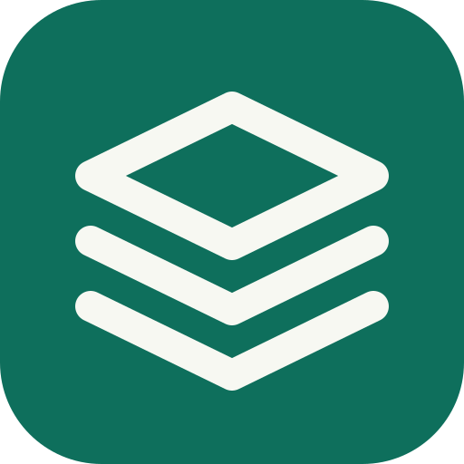
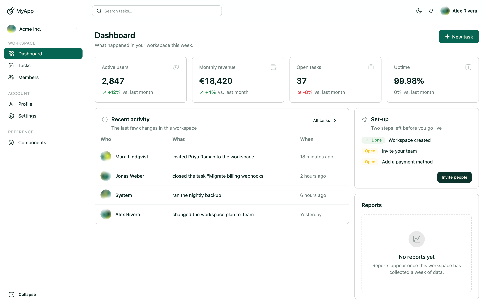
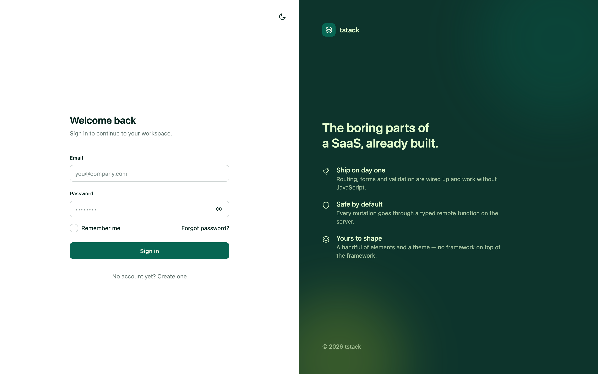
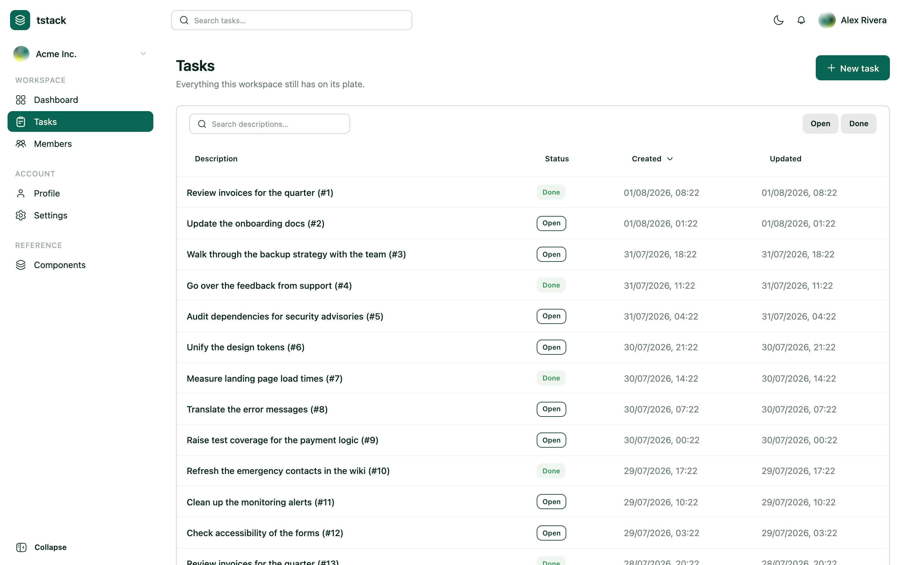
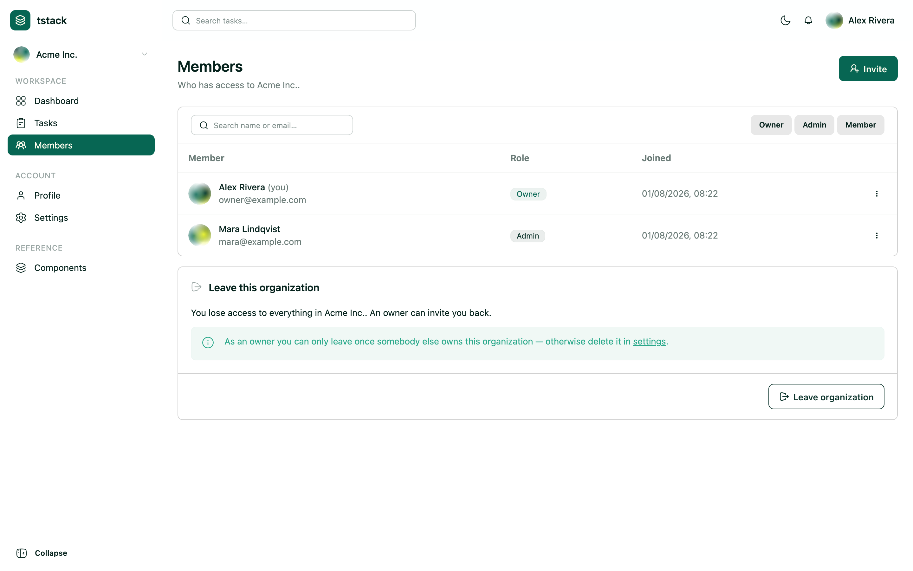
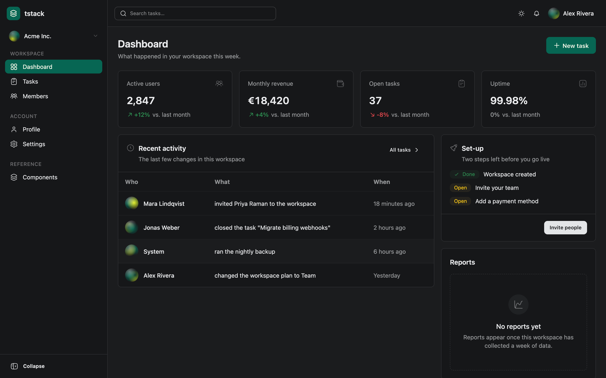
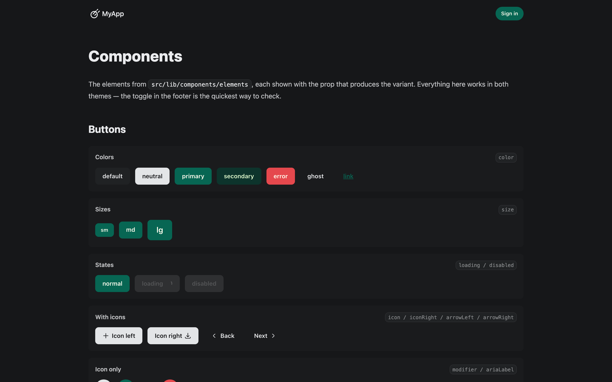

<div align="center">



# tstack

**The boring parts of a SaaS, already built.**

A free, open-source **SvelteKit SaaS boilerplate / starter template**:
authentication, organizations, multi-tenancy, transactional email, image
uploads, a themed component library and a worked CRUD example — so your first
commit is your product, not your plumbing.

[](https://github.com/tguelcan/tstack/actions/workflows/ci.yml)
[](LICENSE)
[](https://svelte.dev)
[](https://svelte.dev/docs/kit)
[](https://www.prisma.io)
[](https://tailwindcss.com)
[](https://daisyui.com)
[](https://bun.sh)
[](CONTRIBUTING.md)

[Quickstart](#quickstart) · [Features](#whats-inside) · [Deploy](#deploy-to-railway) · [Architecture](docs/ARCHITECTURE.md) · [Building with AI agents](#building-with-ai-agents) · [Contributing](CONTRIBUTING.md)

</div>

<picture>
  <source media="(prefers-color-scheme: dark)" srcset=".github/screenshots/dashboard-dark.png">
  
</picture>

<details>
<summary><strong>More screenshots</strong></summary>

|                                   Sign in                                   |                           Tasks (the CRUD example)                           |
| :-------------------------------------------------------------------------: | :--------------------------------------------------------------------------: |
|                               |  |
|  |             |

**Component gallery** — every element ships with a live reference page at `/components`:



</details>

## What's inside

- **Auth that works without JavaScript** — [Better Auth](https://better-auth.com) with email + password, email verification, password reset, and optional Google/GitHub OAuth. Every flow is a progressively-enhanced form.
- **Organizations & multi-tenancy** — workspaces with roles, invitations and an org switcher. Every query is scoped to the active organization, including bulk writes.
- **Remote functions only** — the single client↔server data path is [SvelteKit remote functions](https://svelte.dev/docs/kit/remote-functions); every one starts with an authorization guard.
- **A worked CRUD example** — `/crud` is a task list with search, filters, sorting and "load more", where the entire list state lives in the URL. Copy the pattern for your own models.
- **Component library** — `Button`, `Field`, `Modal`, `DataTable`, `Toaster` and friends on Tailwind 4 + daisyUI 5, with light/dark themes and a live gallery at `/components`.
- **Transactional email** — [Resend](https://resend.com) with one consistent message shape; without an API key every mail is printed to the terminal, so local sign-up just works.
- **Image uploads** — every upload goes through [sharp](https://sharp.pixelplumbing.com) into preset-sized WebP, served with a session gate and path-traversal checks.
- **Typed everything** — Prisma 7 (Postgres), Zod, explicit environment variable declarations, strict TypeScript, ESLint + Prettier.
- **Tested** — unit, browser component and HTTP integration tests, all running in CI.

## Quickstart

You need [bun](https://bun.sh) and a Postgres. No Postgres at hand? `bunx prisma dev` starts a local one and prints the connection URL.

```sh
bun install
cp .env.example .env   # set DATABASE_URL, BETTER_AUTH_SECRET, BETTER_AUTH_URL
bun run db:migrate     # apply migrations
bun run db:seed        # demo users, two organizations, a task list
bun run dev
```

`BETTER_AUTH_SECRET` signs the session cookie — generate one with `openssl rand -base64 32`.
`BETTER_AUTH_URL` has to be the origin the app is reachable at, port included; the links in
verification and invitation emails are built from it, and the app refuses to start without it
outside development.

Leave `RESEND_API_KEY` empty to start: every email is then printed to the terminal instead of
sent, which is what makes signing up locally possible at all given that the address has to be
confirmed first. The seeded accounts skip that — sign in as `owner@example.com` with the
password `demo-password`.

### Make it yours

1. **Name it** — `app.name` in `src/lib/server/config.json`, plus `name` in `package.json`.
2. **Brand it** — the logo in `src/lib/components/layout/Logo.svelte`, the two themes in `src/lib/css/main.css`.
3. **Replace the demo content** — the dashboard figures and billing plans still come from `src/lib/helper/demo.ts`; delete an export there and follow the type errors.
4. **Add your first model** — copy the `/crud` pattern: a Prisma model, a list config next to `src/lib/helper/task.ts`, a remote function, a page. [The architecture guide](docs/ARCHITECTURE.md) walks through it.

## Scripts

| Script                              | Purpose                                                               |
| ----------------------------------- | --------------------------------------------------------------------- |
| `bun run dev` / `build` / `preview` | Vite dev server / production build / preview                          |
| `bun run start`                     | Serve the production build (`node build/index.js`)                    |
| `bun run check`                     | `svelte-check` type checking                                          |
| `bun run lint` / `format`           | Prettier + ESLint / auto-format                                       |
| `bun run test`                      | Vitest (unit + browser component tests)                               |
| `bun run test:integration`          | HTTP integration tests against the production build (needs a DB)      |
| `bun run db:migrate`                | Create/apply Prisma migrations (development)                          |
| `bun run db:deploy`                 | Apply committed migrations (production/CI)                            |
| `bun run db:generate`               | Regenerate the Prisma client into `src/generated`                     |
| `bun run db:seed`                   | Seed demo users, organizations and tasks (skips when there are users) |
| `bun run db:studio`                 | Prisma Studio                                                         |

## Testing

Three layers, all running in [CI](.github/workflows/ci.yml):

- **Unit tests** — colocated `*.spec.ts` next to the helpers they test.
- **Component tests** — `*.svelte.spec.ts` in real Chromium via Vitest browser mode.
- **Integration tests** — `tests/integration/` boots the production build against a real
  Postgres and exercises sign-in, the auth wall and the seeded workspace over plain HTTP:
  `bun run build && bun run test:integration`.

## Deploy to Railway

[](https://railway.com/new/template?template=https%3A%2F%2Fgithub.com%2Ftguelcan%2Ftstack)

The repo ships a [`railway.json`](railway.json) that builds with bun, runs
`prisma migrate deploy` before each deployment and serves `build/index.js`. After clicking the
button (or creating a service from your fork):

1. **Add a Postgres** to the project and reference its URL: `DATABASE_URL = ${{Postgres.DATABASE_URL}}`.
2. **Set the secrets** — `BETTER_AUTH_SECRET` (`openssl rand -base64 32`), and point both
   `BETTER_AUTH_URL` and `ORIGIN` at your public origin, e.g. `https://${{RAILWAY_PUBLIC_DOMAIN}}`.
3. **Attach a volume** and set `UPLOAD_DIR` to its mount path, e.g. `/data/uploads` — anything
   inside the app directory is wiped on the next deployment, along with every avatar and logo.

Details, other platforms and the `sharp` caveat: [docs/DEPLOYMENT.md](docs/DEPLOYMENT.md).

## Building with AI agents

This template is written to be worked on by AI coding agents — the conventions are few, explicit
and machine-checkable:

- **[AGENTS.md](AGENTS.md)** — the contract: architecture rules, guardrails and the commands an
  agent should run before calling anything done. `CLAUDE.md` points Claude Code at the same file.
- **Svelte MCP server** — [`.mcp.json`](.mcp.json) connects agents to the official
  [Svelte MCP server](https://svelte.dev/docs/mcp) for current Svelte 5 / SvelteKit docs and an
  autofixer, so agents don't write Svelte 4 from memory.
- **Guarded by design** — authorization lives in `src/lib/server/guard.ts` and every remote
  function starts with it; the layering means a generated feature is safe by construction, not by
  review.
- **Types as the safety net** — deleting a demo export or renaming a field produces type errors
  that lead an agent through every affected file.

## Documentation

- [Architecture](docs/ARCHITECTURE.md) — remote functions, auth, multi-tenancy, uploads, email, theming, lists.
- [Deployment](docs/DEPLOYMENT.md) — Railway step by step, environment variables, migrations.
- [Contributing](CONTRIBUTING.md) — dev setup, checks, how to get a PR merged.
- [AGENTS.md](AGENTS.md) — the guide AI coding agents (and new humans) should read first.

## Contributing

Found a bug, a rough edge in the docs, or a pattern that deserves to be in the template? PRs and
issues are very welcome — this project grows by being used. Good first contributions: another
OAuth provider, a Stripe-backed billing page to replace the demo plans, more list configs, an
S3-compatible upload target, translations of the content pages. See
[CONTRIBUTING.md](CONTRIBUTING.md) to get started — the whole test suite runs with two commands,
so you'll know quickly whether your change holds.

If tstack saved you a week of plumbing, a ⭐ on the repo helps others find it.

## License

[MIT](LICENSE) — use it, fork it, ship your SaaS with it.
